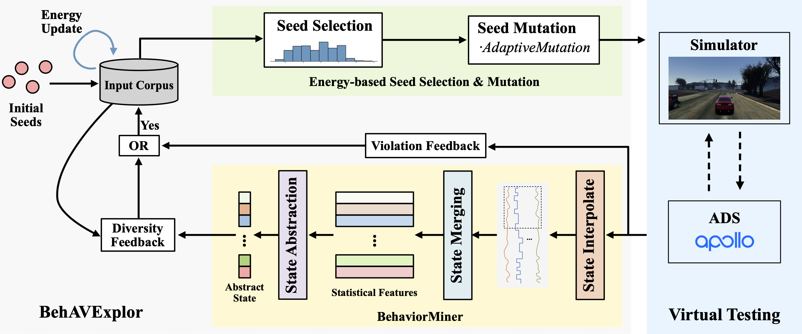

# BehAVExplor
This project is the official implementation of paper:

BehAVExplor: Behavior Diversity Guided Testing for Autonomous Driving Systems  
Authors: Mingfei Cheng, Yuan Zhou and Xiaofei Xie  
[Accepted to ISSTA 2023](https://2023.issta.org/details/issta-2023-technical-papers/32/BehAVExplor-Behavior-Diversity-Guided-Testing-for-Autonomous-Driving-Systems)

## Method Overview


## Settings
Step 1: Config Baidu Apollo (no less than 6.0 version) according to [Apollo](https://github.com/ApolloAuto/apollo)

Step 2: Clone BehAVExplor Project (BehAVExplor.zip) and unzip it under `/apollo` in the apollo container
* Project Structure
    ```
    /apollo
    ├── BehAVExplor
    └── other apollo folders
    ```

Step 3: Install required Python dependency inside the apollo container
```angular2html
cd /apollo/BehAVExplor
sh prepare.sh
```

Step 3: Compile BehAVExplor in the apollo container
```angular2html
cd /apollo
bazel build //BehAVExplor:main
```

Step 4:  Config our custom LGSVL 2021.3 (Download from [link](https://drive.google.com/drive/folders/1t4vSZfipPcCVz2wHbS7OIP-TQ0wBFuU1?usp=sharing))
* Put simulator.zip at ~/lgsvl outside the apollo container
* Double click ~/lgsvl/simulator/simulator/simulator to open LGSVL Simulator
* NOTE: [LGSVL](https://github.com/lgsvl/simulator) was closed, therefore, we will plan to extend this project to [CARLA](https://github.com/carla-simulator/carla).

Step 5: Install default map used by BehAVExplor by unzipping `BehavExplor/data/SanFrancisco.zip` at `/apollo/modules/map/data`. Your file structure should look like this
```
map
|-data
  |-SanFrancisco
    |- base_map.bin
    |- routing_map.bin
    |- ...
```

Step 6: Start Apollo and CyberRT bridge via
```angular2html
cd /apollo
bash scripts/bootstrap.sh
bash scripts/bridge
```

Step 7: Start LGSVL. Run in another terminal (current path is `/apollo` in apollo container)
```angular2html
./bazel-bin/BehAVExplor/main --config=/apollo/BehAVExplor/configs/[scenario config yaml file]
```

## Citation
If you use this code and our results for your research, please cite our paper.
```
@inproceedings{BehAVExplor_ISSTA_2023,
  title={BehAVExplor: Behavior Diversity Guided Testing for Autonomous Driving Systems},
  author={Cheng, Mingfei and Zhou, Yuan and Xie, Xiaofei},
  booktitle={Proceedings of the 32nd ACM SIGSOFT International Symposium on Software Testing and Analysis (ISSTA)},
  year={2023}
}
```
